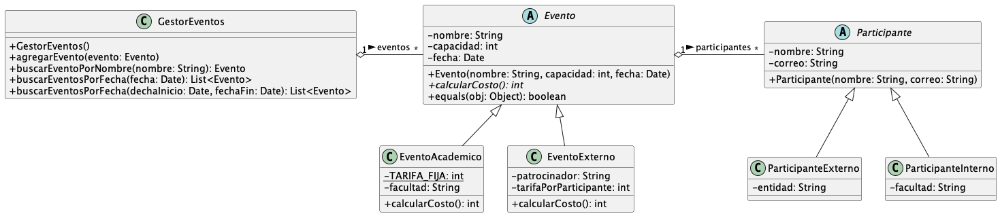

# Solución del Parcial 2 2024-1

## 1. Conceptos (20 puntos) 

1. Un objeto se compone de: </br>
    a. Parámetros y métodos </br>
    b. Estado y comportamiento </br>
    c. Estado y atributos </br>
    d. Métodos y comportamiento </br>
    <details>
         <summary>Ver respuesta</summary>
         b. Estado y comportamiento  
    </details></br>

2. ¿Cuál es nombre de la clase de la que heredan todos los objetos en Java?</br>

   a. Superclass </br>
   b. Object </br>
   c. this </br>
   d. Primitive </br>
   <details>
   <summary>Ver respuesta</summary>
      b. Object  
   </details></br>

3. Cuando se envía un objeto como parámetro a una función, ese objeto se pasa por:</br>

    a. Valor </br>
    b. Referencia </br>
    c. Polimorfismo </br>
    d. Herencia </br>
       <details>
       <summary>Ver respuesta</summary>
          b. Referencia  
       </details></br>

4. El encapsulamiento de métodos consiste en: </br>

    a. Permitir el acceso a métodos privados únicamente a través de métodos públicos </br>
    b. Permitir el acceso a atributos privados únicamente a través de métodos privados</br>
    c. Permitir el acceso a métodos privados únicamente a través de métodos privados </br>
    d. Permitir el acceso a atributos privados únicamente a través de métodos público </br>
       <details>
       <summary>Ver respuesta</summary>
          d. Permitir el acceso a atributos privados únicamente a través de métodos público  
       </details></br>

5. ¿Qué es una excepción?</br>
   a. Es un error automáticamente controlado por java </br>
   b. Es un bloque try - catch que permite manejar los errores</br>
   c. Es un objeto para capturar y manejar errores </br>
   d. Es un programa que se ejecuta cuando hay un error </br>
   <details>
   <summary>Ver respuesta</summary>
   c. Es un objeto para capturar y manejar errores  
   </details></br>

6. ¿Qué ocurre cuando se define un método con el modificador `final` en una clase **A**?</br>
   a. El método debe ser implementado en las clases que heredan de A </br>
   b. El método solo puede ser usado directamente en cualquier parte, pero no puede ser sobrescrito en las clases del mismo paquete</br>
   c. El método no puede ser sobrescrito en las clases que heredan de A </br>
   d. El método debe ser sobrescrito y usado directamente en las clases que heredan de A </br>
   <details>
   <summary>Ver respuesta</summary>
   c. El método no puede ser sobrescrito en las clases que heredan de A 
   </details></br>

7. Suponga que existe una clase Jeep, que hereda de la clase abstracta Automovil, seleccione la instrucción **incorrecta**:</br>
   a. `Automovil A = new Jeep();` </br>
   b. `Jeep A = new Automovil();` </br>
   c. `Jeep A = new Jeep();` </br>
   d. Ninguna de las anteriores </br>
   <details>
   <summary>Ver respuesta</summary>
   b. Jeep A = new Automovil();
   </details></br>


8. ¿En qué contexto se utiliza la palabra reservada `super`?</br>
   a. Para llamar al constructor de la clase padre </br>
   b. Para lamar a un método de la clase padre </br>
   c. Para llamar a un atributo de la clase padre </br>
   d. Todas las anteriores </br>
   <details>
   <summary>Ver respuesta</summary>
   d. Todas las anteriores
   </details></br>

9. ¿Qué es un método abstracto?</br>
   a. Un método que no tiene implementación </br>
   b. Un método que no existe </br>
   c. Un método que no se puede sobreescribir </br>
   d. Un método que no se puede llamar </br>
   <details>
   <summary>Ver respuesta</summary>
   a. Un método que no tiene implementación
   </details></br>

10. ¿Cuántas interfaces puede implementar una clase en Java a la vez?</br>
    a. Una clase solo puede implementar una interfaz a la vez </br>
    b. Una clase puede implementar varias interfaces a la vez</br>
    c. Una clase no puede implementar interfaces </br>
    d. Una clase puede implementar una interfaz y extender otra clase a la vez </br>
   <details>
   <summary>Ver respuesta</summary>
   b. Una clase puede implementar varias interfaces a la vez
   </details></br>


## 2. Gestor de eventos (80 puntos)


Usted ha sido contratado por la Universidad San Bonifacio para desarrollar un sistema que gestione los eventos de dicha institución. El sistema debe permitir el registro de eventos, la administración de una colección de eventos y el almacenamiento de la información en archivos de texto y binarios. Además, debe incluir un registro de los participantes en cada evento.

Desafortunadamente, el desarrollador que estaba trabajando en el sistema renunció para convertirse en YouTuber, dejando el sistema incompleto. Le deseamos la mejor de las suertes en su nuevo rol, ya que seguramente la necesitará. Ahora, para completar el sistema, usted deberá realizar los cambios necesarios.

Por el momento, cuenta con la estructura al final de este documento completamente implementada (note que los métodos escritos en cursiva son abstractos). También dispone de todos los métodos *set* y *get* para los atributos de todas las clases, excepto para la clase `ParticipanteInterno`.

Como puede observar, falta toda la parte de gestión de participantes. El objetivo es que cada evento tenga asociada una lista de participantes, quienes pueden ser de dos tipos: externos o internos (i.e profesores, estudiantes, egresados). De cada participante se almacenará únicamente su nombre y su correo electrónico. Además, los **participantes internos** contarán con un atributo que indica el nombre de la facultad a la que pertenecen, mientras que los externos tendrán un atributo con el nombre de la entidad para la que trabajan (este puede ser una cadena vacía si no tienen empleo).

Para completar esta tarea, por favor realice las siguientes acciones:

1. **[5 pts]** [Complete la clase `ParticipanteInterno`](./src/main/java/org/example/model/participante/ParticipanteInterno.java). Para esto, declare toda la clase, un constructor con parámetros y los métodos *get* y *set* para el atributo `facultad`. </br></br>

2. **[15 pts]** Implemente un [método en la clase `Evento`](./src/main/java/org/example/model/evento/Evento.java#L73) que registre un participante en el evento. El método debe recibir un objeto de tipo `Participante` como parámetro y agregarlo a la lista de participantes del evento. Debe lanzar una excepción si:
   - el evento ya alcanzó su capacidad límite,
   - se intenta inscribir un participante externo en un evento académico, o
   - ya existe un participante registrado con el mismo correo electrónico.</br></br>

3. **[20 pts]** Implemente un [método `agregarParticipante` en la clase `GestorEventos`](./src/main/java/org/example/model/GestorEventos.java#L67) que reciba como parámetros el nombre del evento (no hay eventos con nombres duplicados) y un objeto que represente al participante. Este método debe agregar el participante a la lista de participantes del evento. Debe lanzar una excepción en cualquiera de los siguientes casos:
   - Se intentó inscribir un participante externo en un evento académico.
   - El participante ya está registrado en otro evento en la misma fecha.
   - El participante ya estaba registrado en el evento.
   - El evento ya alcanzó su límite de capacidad.
   Ayuda: Evalúe la opción de escribir métodos auxiliares para facilitar el desarrollo de este punto.</br></br>
   
4. **[10 pts]** Implemente el método `calcularCosto` en las [clases `EventoAcademico`](./src/main/java/org/example/model/evento/EventoAcademico.java#L25) y [`EventoExterno`](./src/main/java/org/example/model/evento/EventoExterno.java#L40). Tenga en cuenta que:
   - En un evento académico, se cobra una tarifa fija por participante (`TARIFA_FIJA`). Sin embargo, los participantes que pertenecen a la facultad organizadora están exentos de este cobro.
   - En los eventos externos, hay una tarifa por participante, pero aquellos que pertenecen a la entidad patrocinadora reciben un descuento del 50% sobre la tarifa.</br></br>

5. **[5 pts]** Implemente un [método `serializar` en la clase `GestorEventos`](./src/main/java/org/example/model/GestorEventos.java#L98) que almacene todos los eventos registrados en un archivo serializado. Este método debe recibir como parámetro un `String` con la ruta del archivo donde se desea guardar la información. Puede asumir que todas las clases del sistema implementan la interfaz `Serializable`. </br></br>

6. **[5 pts]** Implemente un [método `deserializar` en la clase `GestorEventos`](./src/main/java/org/example/model/GestorEventos.java#L109) que cargue los eventos desde un archivo serializado. En caso de que ya existan eventos registrados, estos deben ser eliminados antes de cargar los nuevos. Este método debe recibir como parámetro un `String` con la ruta del archivo desde donde se desea cargar la información. Puede asumir que todas las clases del sistema implementan la interfaz `Serializable`.</br></br>

7. **[20 pts]** Implemente un [método `reporteEventos` en la clase `GestorEventos`](./src/main/java/org/example/model/GestorEventos.java#L135) que reciba la ruta de un archivo de texto e imprima en él un reporte con el siguiente formato:
    ```
      Evento: <Nombre>
      Fecha: <Fecha>
      Capacidad: <Capacidad> participantes
      Tipo: <Académico/Externo>
      Participantes:
         <Nombre> - <Correo> (<Facultad/Entidad>)
         <Nombre> - <Correo> (<Facultad/Entidad>)
      ...
      Evento: <Nombre>
      Fecha: <Fecha>
      Capacidad: <Capacidad> participantes
      Tipo: <Académico/Externo>
      Participantes:
         <Nombre> - <Correo> (<Facultad/Entidad>)
         <Nombre> - <Correo> (<Facultad/Entidad>)
        ...
    ```
</br></br>Para cualquiera de estos métodos, puede utilizar otros métodos desarrollados en distintos puntos de este parcial. En caso de que necesite utilizar métodos adicionales o auxiliares que no estén incluidos en este enunciado, deberá implementarlos completamente.


